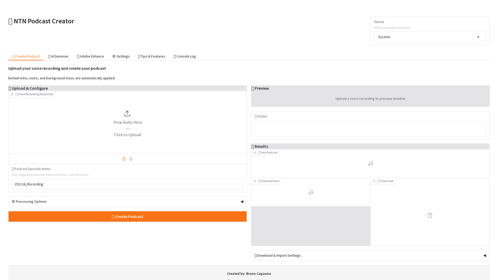

# NTN Podcast Creator

A powerful local Python application for creating professional podcast episodes. Combine your voice recordings with intro/outro audio and background music, with advanced AI-powered audio processing capabilities.

## 🎯 Goal

NTN Podcast Creator simplifies podcast production by providing an intuitive web interface for:
- Mixing voice recordings with intro, outro, and background music
- AI-powered noise reduction and audio enhancement
- Professional loudness normalization (LUFS)
- Automatic transcription with OpenAI Whisper
- Individual volume controls for each audio track

This tool was created to support the **"No Tiene Nombre"** podcast production workflow, making it easy to produce high-quality episodes efficiently.

## 🎙️ Created for "No Tiene Nombre" Podcast

This application is built to support the production needs of the **No Tiene Nombre** podcast.

**🌐 Visit the podcast:** [https://notienenombre.com](https://notienenombre.com/)

While designed with this podcast in mind, the tool is flexible and can be used by anyone looking to create professional podcasts.

## 📸 Screenshots

### Application Demo



*Complete podcast creation workflow - from audio upload to final export with transcription*

> **Note:** To generate updated screenshots, run `python scripts/capture_screenshots.py` while the application is running. 
> See [Screenshot Guidelines](docs/images/SCREENSHOT_GUIDELINES.md) for details.

### Main Features

The application provides an intuitive interface for podcast creation with:
- Voice recording upload and processing
- Intro/outro audio integration
- Background music with individual track controls
- AI-powered audio denoising
- Professional LUFS normalization
- Automatic transcription with Whisper

For detailed screenshots of each feature, see the [User Manual](docs/USER_MANUAL.md).

### Theme Support

The application supports three theme modes:
- **Light**: Bright interface for daytime use
- **Dark**: Easy on the eyes for low-light environments  
- **System**: Automatically matches your system theme

<!-- Theme selector screenshots will be available in docs/images/screenshots/ -->

## ✨ Key Features

- **🎨 Intuitive Multi-Tab Interface**: Easy navigation for podcast creation, audio processing, and settings
- **🎵 Smart Audio Mixing**: Automatically mix intro, outro, and background music with your voice
- **🤖 AI Audio Processing**: Multiple noise reduction methods and Adobe Enhance integration
- **📊 Professional Normalization**: LUFS normalization to broadcast standards
- **📝 Automatic Transcription**: Generate transcripts in 99+ languages with Whisper
- **🎛️ Individual Volume Controls**: Fine-tune each background track separately
- **💾 Settings Management**: Export and import configurations
- **🎨 Theme Selector**: Choose between light, dark, or system themes

## 🚀 Quick Start

### Using Docker (Recommended)

```bash
git clone https://github.com/elbruno/ntn-podcast-creator.git
cd ntn-podcast-creator/deployment
docker-compose up -d
```

Access at http://localhost:7860

### Local Installation

```bash
git clone https://github.com/elbruno/ntn-podcast-creator.git
cd ntn-podcast-creator
pip install -r requirements.txt
python app.py
```

**Note:** FFmpeg is required. See installation instructions below.

## 📚 Documentation

Comprehensive documentation is available in the `docs/` folder:

- **[User Manual](docs/USER_MANUAL.md)** - Complete guide with step-by-step instructions and screenshots
- **[Technical Implementation](docs/TECHNICAL_IMPLEMENTATION.md)** - Architecture, API reference, and technical details
- **[Docker Deployment Guide](docs/DOCKER.md)** - Run with Docker in minutes (no Python/FFmpeg install needed)
- **[Docker Publishing Guide](docs/DOCKER_PUBLISH.md)** - Instructions for publishing Docker images
- **[Audio Denoising Implementation](docs/AUDIO_DENOISING_IMPLEMENTATION.md)** - AI-powered noise reduction guide
- **[Structure Improvements](docs/STRUCTURE_IMPROVEMENTS.md)** - Project organization and architecture
- **[Release Notes](docs/RELEASE_NOTES_CHUNKING.md)** - Latest features and enhancements
- **[Dev Container Guide](.devcontainer/README.md)** - Setup for containerized development

## 📋 Requirements

- Python 3.8 or higher
- FFmpeg 4.0+ (required for audio processing)
- Optional: Docker for containerized deployment

### Installing FFmpeg

**Ubuntu/Debian:**
```bash
sudo apt-get update && sudo apt-get install ffmpeg
```

**macOS:**
```bash
brew install ffmpeg
```

**Windows:**
Download from [FFmpeg website](https://ffmpeg.org/download.html) and add to PATH.

## 🧪 Testing

Run the comprehensive unit test suite:

```bash
python -m unittest tests.test_units -v
```

All tests cover ConfigManager, AudioProcessor, and app helper functions.

## 👨‍💻 Created By

**Bruno Capuano**  
🔗 [https://aka.ms/elbruno](https://aka.ms/elbruno)

**Podcast: No Tiene Nombre**  
🎙️ [https://notienenombre.com](https://notienenombre.com/)

## 📄 License

MIT License - see [LICENSE](LICENSE) file for details

