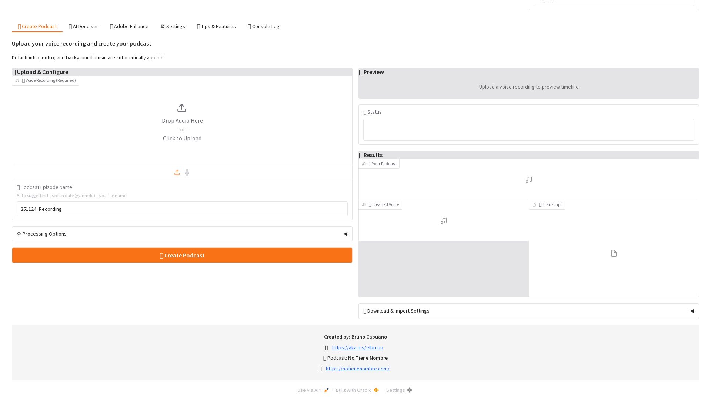

# NTN Podcast Creator - User Manual

## Table of Contents
1. [Introduction](#introduction)
2. [Getting Started](#getting-started)
3. [Interface Overview](#interface-overview)
4. [Step-by-Step Guide](#step-by-step-guide)
5. [Features in Detail](#features-in-detail)
6. [Tips and Best Practices](#tips-and-best-practices)
7. [Troubleshooting](#troubleshooting)
8. [FAQ](#faq)

---

## Introduction

Welcome to the **NTN Podcast Creator**! This application helps you create professional-sounding podcasts by combining your voice recordings with intro/outro audio and background music. All settings are automatically saved, making it easy to maintain consistency across multiple podcast episodes.

### What Can You Do?

- ✅ **Smart Episode Naming**: Auto-suggested names with date (yymmdd) + your filename
- ✅ **Multi-File Upload**: Upload and automatically concatenate multiple audio files into one podcast
- ✅ **Multi-Tab Interface**: Easy navigation with dedicated tabs for different tasks
- ✅ **AI Audio Denoising**: Clean voice recordings using machine learning (enabled by default)
  - **NEW**: Supports files of any size with automatic chunking for large recordings
  - Automatically processes files >10MB by splitting into manageable chunks
- ✅ **Adobe Enhance Integration**: Standalone tab for audio enhancement or automatic during podcast creation
- ✅ Add custom intro and outro audio to your podcast
- ✅ Mix background music that automatically loops to match your recording
- ✅ Control background music volume with precision - both globally and per-track
- ✅ Apply different volume levels to each background music file
- ✅ Preview tracks with applied volume settings before creating your podcast
- ✅ Save and export your configuration settings as JSON files
- ✅ Import previously saved settings to quickly recreate your setup
- ✅ View all background tracks and their volumes in the visual timeline
- ✅ Save all settings automatically for future podcast episodes
- ✅ Export professional MP3 files ready for distribution
- ✅ Download cleaned voice audio separately for other uses

---

## Getting Started

### Prerequisites

Before using the NTN Podcast Creator, ensure you have:

- **Python 3.8 or higher** installed on your system
- **FFmpeg** installed (required for audio processing)
- Audio files ready (your podcast recording, optional intro/outro, optional background music)

### Installation Methods

#### Option 1: Using Docker (Fastest & Easiest)

No need to install Python or FFmpeg! Docker handles everything:

1. Install [Docker Desktop](https://www.docker.com/products/docker-desktop)
2. Clone the repository:
   ```bash
   git clone https://github.com/elbruno/ntn-podcast-creator.git
   cd ntn-podcast-creator
   ```
3. Start with Docker Compose:
   ```bash
   docker-compose up -d
   ```
4. Open your browser to `http://localhost:7860`

**📖 See [Docker Deployment Guide](DOCKER.md) for detailed instructions**

#### Option 2: Using Dev Container (For VS Code Users)

If you use Visual Studio Code:

1. Install [Docker Desktop](https://www.docker.com/products/docker-desktop)
2. Install the [Dev Containers extension](https://marketplace.visualstudio.com/items?itemName=ms-vscode-remote.remote-containers)
3. Open the repository in VS Code
4. Click "Reopen in Container" when prompted
5. Everything installs automatically!

#### Option 3: Manual Installation

1. **Clone the repository:**
   ```bash
   git clone https://github.com/elbruno/ntn-podcast-creator.git
   cd ntn-podcast-creator
   ```

2. **Install FFmpeg:**

   - **Ubuntu/Debian:**
     ```bash
     sudo apt-get update && sudo apt-get install ffmpeg
     ```

   - **macOS:**
     ```bash
     brew install ffmpeg
     ```

   - **Windows:** Download from [FFmpeg website](https://ffmpeg.org/download.html) and add to PATH

3. **Install Python dependencies:**
   ```bash
   pip install -r requirements.txt
   ```

### Starting the Application

#### If Using Docker:
```bash
# Start (if not already running)
docker-compose up -d

# View logs
docker-compose logs -f

# Stop
docker-compose down
```

Access at `http://localhost:7860`

#### If Using Local Installation:
1. Open a terminal in the project directory
2. Run the application:
   ```bash
   python app.py
   ```
3. Open your web browser and navigate to: `http://127.0.0.1:7860`
4. The interface will load automatically

---

## Interface Overview

### Application Demo


*Complete podcast creation workflow demonstration*

> **📸 Viewing Detailed Screenshots:** For detailed screenshots of each section, refer to the [images/screenshots/](images/screenshots/) directory, or run `python scripts/capture_screenshots.py` to generate fresh screenshots from your running application.

The interface features a modern tabbed layout for easy navigation and includes several key UI enhancements:

### Header Features

**🎨 Theme Selector** (Top Right)
- Choose between **Light**, **Dark**, or **System** themes
- Instantly changes the UI appearance
- **System** mode automatically matches your operating system theme
- Theme preference is saved and persists across sessions
- No page refresh needed - theme changes apply immediately

<!-- Theme selector screenshot: images/screenshots/01-initial-view.png shows the header with theme selector -->

### Real-Time Progress Tracking

When creating a podcast, two dynamic UI elements provide live feedback:

**Top Progress Bar**
- Fixed position at the top of the page
- Shows current processing step (e.g., "🔧 Removing noise...", "🎵 Mixing audio...")
- Displays progress percentage (0-100%)
- Visual progress bar with smooth animations
- Automatically appears when podcast creation starts

**Bottom Console Log**
- Fixed position at the bottom of the page
- Shows last 10 log entries in real-time
- Provides detailed status updates during processing
- Includes timestamps for each message
- Close button to dismiss when complete
- Automatically appears with progress bar

<!-- Progress tracking is demonstrated in the animated GIF above -->

### Tabs Overview

#### 🎙️ Create Podcast Tab (Main Tab)
The primary workspace for creating your podcast episodes.

**Key Elements:**
- **Voice Recording Upload:** Upload your main podcast audio file
  - Supported formats: MP3, WAV, M4A, OGG, and other common audio formats
  - Options: Upload from computer or record directly in browser
- **Podcast Episode Name:** Auto-suggested based on today's date (yymmdd) + your file name
  - Example: "251123_my_podcast" for a file uploaded on November 23, 2025
  - Fully editable - modify as needed
- **⚙️ Options Accordion:**
  - Delete voice recording after creation (saves storage)
  - Trim silence from voice recording
  - Clean audio using AI denoiser (recommended)
  - Apply Adobe Enhance (optional, adds 2-5 minutes processing time)
- **Timeline Preview:** Visual representation of how your podcast segments are arranged
- **Status Display:** Real-time feedback during processing
- **Download Areas:**
  - Your Podcast: The final mixed episode
  - Cleaned Voice: AI-denoised audio (if denoising enabled)
  - Settings Download & Import: Export/import configuration

#### ✨ Adobe Enhance Tab
Dedicated workspace for standalone audio enhancement.


**Purpose:** Clean and enhance audio files using Adobe's AI before creating podcasts
**Features:**
- Upload voice recordings for enhancement
- 2-5 minute processing time
- Preview enhanced audio
- Download enhanced files for other uses
- Detailed processing logs

**Use Cases:**
- Pre-process audio before podcast creation
- Clean recordings for other projects
- Test Adobe Enhance without creating a full podcast

#### ⚙️ Settings Tab
Configure audio files and volume settings.

**Sections:**
1. **Intro Audio:** Upload and manage intro audio that plays before your recording
2. **Outro Audio:** Upload and manage outro audio that plays after your recording
3. **Background Music:** Add and manage multiple background tracks
   - Upload multiple tracks
   - Delete individual tracks
   - Play/preview tracks
   - Set individual volume for each track
   - Apply global volume to all tracks
4. **Volume Settings:**
   - Global volume control (0-50%, recommended: 10-12%)
   - Individual track volume adjustment
   - Preview tracks with applied volume

#### 📋 Console Log Tab
View detailed processing logs and troubleshooting information.

**Shows:**
- Podcast creation progress
- Adobe Enhance processing status
- Error messages and warnings
- Configuration changes
- File operations

---

## Step-by-Step Guide

### Basic Workflow: Creating Your First Podcast


*Voice recording upload interface*

#### Step 1: Upload Your Main Voice Recording (🎙️ Create Podcast Tab)

1. Navigate to the **🎙️ Create Podcast** tab (default tab)
2. Click on the **"🎤 Voice Recording(s) (Required)"** upload area
3. Select your podcast audio file(s) from your computer
   - **NEW**: You can now upload **multiple audio files** at once!
   - Multiple files will be automatically concatenated in the order they are uploaded
   - This is useful for recording your podcast in segments or combining different recordings
4. Wait for the upload to complete
5. Notice the **Podcast Episode Name** field automatically fills with today's date + your filename
   - Example: "251123_my_recording" for a file uploaded on November 23, 2025
6. Edit the episode name if desired
7. The timeline preview will update showing your total recording duration (sum of all files)

**💡 Tip:** Make sure your voice recording is already edited and ready. This tool combines audio but doesn't edit individual tracks.

**🆕 Multi-File Upload Feature:**
- Upload multiple audio files that will be automatically joined together
- Files are concatenated in the upload order, so order matters!
- All common audio formats are supported (MP3, WAV, M4A, etc.)
- Perfect for:
  - Recording your podcast in multiple sessions
  - Combining different segments or chapters
  - Splitting long recordings into manageable parts

#### Step 2: (Optional) Configure Processing Options


*Audio processing options including denoising and enhancement*

Expand the **⚙️ Options** accordion to adjust:

1. **Delete voice recording after creation** (enabled by default)
   - Saves storage space by removing the uploaded file after processing
2. **Trim silence from voice recording** (enabled by default)
   - Automatically removes silence from start and end
3. **Clean audio using AI denoiser** (enabled by default, recommended)
   - Uses machine learning to remove background noise
   - Results in clearer, more professional sound
4. **Apply Adobe Enhance** (disabled by default, optional)
   - Uses Adobe's AI to further enhance audio quality
   - Adds 2-5 minutes to processing time
   - Alternatively, use the **✨ Adobe Enhance** tab for standalone processing

**💡 Tip:** For best results, keep AI denoiser enabled. Only enable Adobe Enhance if you need additional processing.

#### Step 3: (Optional) Configure Audio Settings (⚙️ Settings Tab)


*Intro and outro audio file selection interface*

Switch to the **⚙️ Settings** tab to add intro, outro, or background music:

##### Add an Intro

1. In the **Intro Audio** section, click the **"Upload New Intro"** button
2. Select your intro audio file
3. The current intro display will update
4. Play the intro in the audio player to verify

**💡 Tip:** Keep intros short (10-30 seconds) to maintain listener engagement.

##### Add an Outro

1. In the **Outro Audio** section, click the **"Upload New Outro"** button
2. Select your outro audio file
3. The current outro display will update
4. Play the outro in the audio player to verify
4. Your outro will play after your main recording

**💡 Tip:** Use outros to encourage listeners to subscribe, rate, or visit your website.

##### Add Background Music


*Background music selection and volume controls*

1. In the **Background Music** section, click the **"Upload Background Track"** button
2. Select a music file
3. Click the **"Add Track"** button
4. The track appears in the "Current Tracks" list
5. Repeat to add more tracks (optional)

**💡 Tip:** Upload multiple tracks for variety. The app randomly selects and mixes tracks to match your podcast duration.

##### Adjust Volume Settings

**Global Volume Control:**
1. Use the **"Default Background Music Volume (%)"** slider (0-50%)
2. Recommended: 10-12% for clear voice quality
3. Click **"📢 Apply Volume to All Tracks"** to set all tracks to the same volume

**Individual Track Volume:**
1. Select a track from the dropdown
2. Use the **"Selected Track Volume (%)"** slider to adjust
3. Preview the track with applied volume in the audio player below
4. Each track can have its own volume level

#### Step 4: Create Your Podcast (🎙️ Create Podcast Tab)

Return to the **🎙️ Create Podcast** tab:

1. Review the automatically generated episode name or modify it
2. Check the timeline preview to see your podcast structure
3. Verify your processing options in the **⚙️ Options** accordion
4. Click the **"🎬 Create Podcast"** button
5. Wait for processing to complete (progress shown in Status area)
6. Download your finished podcast from the **"🎧 Your Podcast"** player
7. Optionally download the **"🎵 Cleaned Voice"** file

**💡 Tip:** Processing time varies based on file size and options selected:
- Basic podcast: Few seconds
- With AI denoiser (small files): 10-30 seconds
- With AI denoiser (large files >10MB): 2-7 minutes with automatic chunking
- With Adobe Enhance: 2-5 minutes additional time

### Advanced Workflow: Using Adobe Enhance Standalone

#### When to Use the ✨ Adobe Enhance Tab

Use this tab when you want to:
- Clean audio files before creating podcasts
- Enhance recordings for other projects
- Test Adobe Enhance without full podcast creation
- Pre-process multiple files

#### Steps:

1. Navigate to the **✨ Adobe Enhance** tab
2. Read the instructions and tips provided
3. Upload your voice recording
4. Choose whether to delete the uploaded file after enhancement
5. Click **"✨ Enhance Audio"**
6. Wait 2-5 minutes for processing
7. Monitor progress in the Processing Log accordion
8. Download the enhanced audio from the preview player

**💡 Tip:** You can enhance audio in this tab, then upload the enhanced file to the **🎙️ Create Podcast** tab for final podcast creation.

---

## Features in Detail
   - Exports as MP3

4. Progress updates appear in the "Status" field

#### Step 7: Download Your Podcast

1. Once processing completes, a success message appears
2. An audio player shows your finished podcast
3. Click the download button to save the MP3 file
4. Test the audio to ensure quality

**💡 Tip:** Listen to the entire podcast before publishing to ensure all elements mixed correctly.

---

## Features in Detail

### AI Audio Denoising

**What is it?**
AI Audio Denoising is a machine learning-powered feature that automatically removes background noise from your voice recordings.

**New in Latest Version: Multiple Denoising Methods**
You can now choose from three different noise reduction algorithms to best suit your recording environment:

1. **AI Denoiser (Recommended)**:
   - Uses a 38-million parameter deep learning model
   - Best for general speech enhancement
   - Supports large files with automatic chunking

2. **Spectral Gating**:
   - Uses spectral subtraction
   - Best for stationary noise like fans or hums
   - Very fast processing

3. **FFmpeg RNNoise**:
   - Uses Recurrent Neural Network noise suppression
   - Good for real-time style noise reduction

**Key Features:**

1. **Automatic Noise Removal:**
   - Removes background hum, air conditioning, fan noise
   - Eliminates microphone handling noise
   - Reduces electrical interference and buzzing
   - Preserves speech quality while cleaning audio

2. **Large File Support:**
   - **Supports files of any size** through intelligent chunking
   - Files >10MB are automatically split into manageable 8MB chunks
   - Each chunk is processed individually, then seamlessly merged
   - No file size limitations - process hours-long recordings
   - Automatic cleanup of temporary files

**When to Use AI Denoising:**

- ✅ **Always recommended** - enabled by default
- ✅ Home recording setups with background noise
- ✅ Interview recordings in non-studio environments
- ✅ Large files (>10MB) that need noise reduction
- ✅ Long-form content (hours of audio)
- ✅ Quick noise reduction without cloud services

### Volume Normalization (LUFS)

**What is it?**
Professional audio loudness normalization to broadcast standards. This ensures your podcast has a consistent volume level that matches industry standards.

**Settings:**
- **Enable**: Turn on/off (recommended: On)
- **Target Level**:
  - **-16 LUFS**: Standard for podcasts (Recommended)
  - **-14 LUFS**: Standard for streaming platforms (Spotify, etc.)
  - **-23 LUFS**: Standard for broadcast radio

**Benefits:**
- Consistent volume across all episodes
- No need to manually adjust volume for each recording
- Prevents audio from being too quiet or too loud
- Meets submission requirements for podcast platforms

### Automatic Transcription (Whisper)

**What is it?**
Generate accurate text transcripts of your podcast using OpenAI's Whisper model.

**Features:**
- **High Accuracy**: State-of-the-art speech recognition
- **Timestamped**: Includes timing for each segment
- **Multiple Models**: Choose the balance between speed and accuracy
  - **Tiny**: Fastest, good for drafts
  - **Base**: Recommended balance
  - **Small/Medium/Large**: Higher accuracy, slower processing

**How to use:**
1. Check "Generate transcript with Whisper" in Basic Options
2. Select your preferred model size
3. Create your podcast
4. Download the generated transcript file

**Note:** The first time you use a model, it will be downloaded automatically (requires internet). Subsequent runs work offline.

### Adobe Enhance Audio (Optional)

**What is it?**
Adobe Enhance is an AI-powered audio enhancement tool that automatically cleans up your voice recordings by:
- Removing background noise
- Reducing echo and reverb
- Enhancing speech clarity
- Normalizing audio levels
- Improving overall sound quality

**Two Ways to Use Adobe Enhance:**

#### Method 1: Automatic Enhancement During Podcast Creation

1. **Navigate to Create Podcast Tab**
2. **Find the Adobe Enhance Assistant Section**
   - Located below the "Trim silence" option
   - Clearly labeled with heading
3. **Enable Automatic Enhancement**
   - Check the box: "Run Adobe Enhance automatically during podcast creation"
   - This will enhance your voice before mixing with intro/outro/background
4. **Create Your Podcast**
   - Upload your voice recording
   - Click "Create Podcast"
   - Adobe Enhance runs automatically in the background
   - Watch the console log for progress updates
   - Final podcast uses the enhanced audio

#### Method 2: Standalone Enhancement (Preview and Download)

1. **Navigate to Create Podcast Tab**
2. **Upload Your Voice Recording**
3. **Expand the Adobe Enhance Section**
   - Click on "✨ Enhance voice only (no mixing)"
4. **Run Standalone Enhancement**
   - (Optional) Check "Delete uploaded file after enhancement"
   - Click "Run Adobe Enhance Now"
   - Watch progress in the log viewer
5. **Download Enhanced Audio**
   - Listen to the preview
   - Download the enhanced file
   - Use it in any project or reuse in podcast creation

**Initial Setup (One-Time):**

1. **Install Playwright Browser**
   ```bash
   pip install playwright
   playwright install chromium
   ```

2. **Configure Adobe Credentials (Optional)**
   - Create or edit `.env` file in the project directory
   - Add your Adobe account details:
   ```
   ADOBE_EMAIL=your-email@example.com
   ADOBE_PASSWORD=your-password
   ADOBE_ENHANCE_HEADLESS=true
   ```
   - **Note:** Adobe Enhance may work without login for basic use

3. **For Docker/Container Users**
   - If running in a container without display:
   ```bash
   # Install xvfb for virtual display
   sudo apt-get update && sudo apt-get install -y xvfb

   # Run app with virtual display
   xvfb-run python app.py
   ```

**How It Works:**

1. **Browser Automation:** The app uses Playwright to automate interaction with Adobe's web service
2. **File Upload:** Your audio is uploaded to Adobe's servers
3. **AI Processing:** Adobe's AI enhances the audio (typically 2-5 minutes)
4. **Download:** Enhanced audio is downloaded automatically
5. **Integration:** Enhanced audio is used in your podcast or available for download

**Progress Monitoring:**
- Detailed logs show each step:
  - Navigating to Adobe Enhance
  - Uploading file (shows file size and timeout)
  - Processing status updates
  - Download completion
  - Total time elapsed

**Privacy & Security:**
- Your audio is uploaded to Adobe's servers for processing
- Adobe credentials stored in `.env` file (not committed to git)
- Headless mode runs browser invisibly for security
- Set `ADOBE_ENHANCE_HEADLESS=false` only for debugging

**When to Use Adobe Enhance:**
- ✅ Voice recorded in noisy environment
- ✅ Audio with echo or reverb
- ✅ Inconsistent audio levels
- ✅ Want professional polish without manual editing
- ✅ Quick cleanup for interview recordings

**When to Skip:**
- ❌ Already professionally edited audio
- ❌ Time-sensitive projects (adds 2-5 minutes)
- ❌ Very large files (>100MB may timeout)
- ❌ Offline workflow requirements

**Troubleshooting Adobe Enhance:**

See the dedicated Troubleshooting section below for common issues like:
- Playwright browser not installed
- Missing display errors (X server)
- Login failures
- Timeout errors
- Network connection issues

### Settings Persistence

**What is it?**
All your settings are automatically saved to a `config.json` file in the application directory.

**What gets saved:**
- ✅ Intro audio file path
- ✅ Outro audio file path
- ✅ All background music track paths
- ✅ Background music volume setting
- ✅ Last output filename

**How it helps:**
- No need to re-upload intro/outro for each episode
- Maintain consistent branding across episodes
- Quick podcast creation for regular shows

**When settings reset:**
- If you delete `config.json`
- If you move audio files to different locations
- If you explicitly clear settings

### Background Music System

**Random Selection:**
When you have multiple background tracks uploaded, the application randomly selects one each time you create a podcast. This adds variety to your episodes without manual work.

**Automatic Looping:**
The selected background music automatically repeats (loops) to match the exact duration of your podcast. You don't need to worry about:
- Music being too short
- Music being too long
- Timing the music to your voice

**Volume Adjustment:**
Background music volume is reduced using professional audio techniques:
- Uses logarithmic scaling for natural sound
- 10% volume = -20 dB reduction
- 50% volume = -6 dB reduction

### Audio Processing

**Supported Input Formats:**
- MP3 (MPEG Audio Layer 3)
- WAV (Waveform Audio File Format)
- M4A (MPEG-4 Audio)
- OGG (Ogg Vorbis)
- FLAC (Free Lossless Audio Codec)
- And many more supported by FFmpeg

**Output Format:**
- Always exports as MP3 for maximum compatibility
- Maintains good quality while keeping file size reasonable
- Ready for upload to podcast platforms

**Audio Sequence:**
```
[Intro] → [Main Voice] → [Outro]
         (with background music underneath entire podcast)
```

### File Management

**Upload Directory:**
All uploaded files are stored in `uploads/` directory:
- Organized storage
- Files persist between sessions
- Easy to manage and backup

**Output Directory:**
Generated podcasts are saved in `outputs/` directory:
- All your created podcasts in one place
- Named according to your specification
- Never overwrites existing files automatically

---

## Tips and Best Practices

### Audio Quality Tips

1. **Record in a quiet environment**
   - Minimize background noise in your voice recording
   - The mixer can't remove noise from your original audio

2. **Use consistent audio levels**
   - Normalize your voice recording before upload
   - Avoid recordings that are too quiet or too loud

3. **Choose appropriate background music**
   - Instrumental works best (no competing vocals)
   - Avoid music with dramatic volume changes
   - Use royalty-free music to avoid copyright issues

4. **Test volume levels**
   - Start with 10% background volume
   - Create a test podcast and listen
   - Adjust if needed

### Workflow Efficiency

1. **Set up once, reuse many times**
   - Upload your intro/outro once
   - Add all your background music tracks
   - Set your preferred volume
   - Create multiple episodes quickly

2. **Organize your audio files**
   - Keep source files separate from outputs
   - Use consistent naming (episode_001.mp3, episode_002.mp3)
   - Back up your config.json file

3. **Quality check before publishing**
   - Always listen to the full podcast
   - Check intro/outro transitions
   - Verify background music isn't too loud or too quiet
   - Test on different devices (headphones, speakers, phone)

### Background Music Strategy

1. **Build a library**
   - Upload 3-5 different background tracks
   - Provides variety across episodes
   - Keeps your podcast fresh

2. **Match the mood**
   - Upbeat music for energetic podcasts
   - Calm music for informative content
   - Match music style to your brand

3. **Consider your audience**
   - Some listeners prefer no background music
   - Others enjoy subtle ambiance
   - Survey your audience for preferences

---

## Advanced Features

### Individual Volume Control for Background Tracks

**New in Latest Version!**

You can now set different volume levels for each background music file, giving you precise control over how your podcast sounds.

#### How to Use Individual Volume Control

1. **Navigate to Settings Tab**
   - Click on the "Settings" tab
   - Scroll down to the "Background Music" section

2. **Select a Track**
   - In the dropdown menu labeled "Select Track to Play or Delete"
   - Choose the background track you want to adjust
   - The track will load in the audio player

3. **Adjust Individual Volume**
   - Use the "Selected Track Volume (%)" slider
   - Range: 0-50% (recommended: 10-12%)
   - Changes are saved immediately
   - Preview the track with the new volume in "Preview Track with Applied Volume"

4. **Apply to All Tracks**
   - Set the "Default Background Music Volume (%)" slider to your desired level
   - Click the "📢 Apply Volume to All Tracks" button
   - All background tracks will now use this volume level

#### Volume Control Tips

- **Different moods**: Use lower volume (5-8%) for intense, dramatic sections
- **Variety**: Use higher volume (12-15%) for intros/outros, lower for main content
- **Consistency**: Use "Apply to All" when you want uniform background volume
- **Preview first**: Always listen to the preview before creating your final podcast

#### Visual Timeline Display

The timeline preview now shows:
- **All background tracks** that will be used in your podcast
- **Volume level** for each track
- **Color-coded segments** for easy identification

Example:
```
🎼 Background Tracks:
  • track1.mp3 - Volume: 10%
  • track2.mp3 - Volume: 15%
  • track3.mp3 - Volume: 8%
```

---

### Settings Export and Import

**New in Latest Version!**

Save and load your entire configuration, making it easy to:
- Backup your settings
- Share configurations with team members
- Switch between different podcast styles
- Recreate a specific setup quickly

#### Exporting Settings

1. **Create Your Perfect Setup**
   - Configure intro, outro, and background tracks
   - Adjust all volume levels
   - Test and refine until satisfied

2. **Export Configuration**
   - In the "Create Podcast" tab
   - Click "💾 Download Settings"
   - A JSON file will be generated with a timestamp
   - Save this file to your computer

3. **What Gets Exported**
   - Intro file path
   - Outro file path
   - All background music tracks
   - Global volume setting
   - Individual track volumes
   - Last output filename
   - Export date/time

#### Importing Settings

1. **Prepare Settings File**
   - Locate your previously exported JSON settings file
   - Ensure audio files referenced still exist in the same locations

2. **Import Configuration**
   - In the "Create Podcast" tab
   - Under "Import Settings"
   - Click "Upload Settings File (JSON)"
   - Select your JSON file
   - Wait for "Import Status" to confirm success

3. **Verify Imported Settings**
   - Go to the "Settings" tab
   - Check that all audio files loaded correctly
   - Verify volume levels
   - Make any necessary adjustments

#### Use Cases for Export/Import

**Different Podcast Series:**
```
- Weekly_News_Show_Settings.json (low background, formal intro)
- Interview_Series_Settings.json (moderate background, friendly intro)
- Story_Time_Settings.json (high background, dramatic intro)
```

**Team Collaboration:**
```
- Share settings with co-hosts
- Maintain consistent branding
- New team members can quickly get started
```

**Backup and Recovery:**
```
- Regular backups before major changes
- Restore previous configurations
- Version control for your podcast setup
```

#### Settings File Format

The exported JSON file looks like this:
```json
{
  "intro_file": "audios/intro_audio/intro.mp3",
  "outro_file": "audios/outro_audio/outro.mp3",
  "background_tracks": [
    "audios/background_music/track1.mp3",
    "audios/background_music/track2.mp3"
  ],
  "background_volume": 10,
  "track_volumes": {
    "audios/background_music/track1.mp3": 10,
    "audios/background_music/track2.mp3": 15
  },
  "last_output_name": "podcast_output",
  "export_date": "YYYY-MM-DDTHH:MM:SS"
}
```

**💡 Tip:** Keep a folder of settings files for different podcast types or seasons!

---

## Troubleshooting

### Common Issues and Solutions

#### App Won't Start

**Problem:** Error when running `python app.py`

**Solutions:**
1. Check Python version: `python --version` (need 3.8+)
2. Install dependencies: `pip install -r requirements.txt`
3. Check for FFmpeg: `ffmpeg -version`
4. Review error messages in terminal

#### FFmpeg Not Found

**Problem:** "FFmpeg not found" or similar error

**Solutions:**
1. **Ubuntu/Debian:** `sudo apt-get install ffmpeg`
2. **macOS:** `brew install ffmpeg`
3. **Windows:** Download from ffmpeg.org and add to PATH
4. Verify installation: `ffmpeg -version`

#### Upload Fails

**Problem:** Audio file won't upload

**Solutions:**
1. Check file format (use common formats: MP3, WAV)
2. Check file size (very large files may timeout)
3. Check file permissions (can the app read the file?)
4. Try a different file to isolate the issue

#### Background Music Too Loud/Quiet

**Problem:** Background music overpowers voice or is barely audible

**Solutions:**
1. Adjust the volume slider
2. Recommended range: 10-12%
3. Create test podcasts to find your sweet spot
4. Consider your source audio levels

#### Output File Not Created

**Problem:** Podcast creation finishes but no file appears

**Solutions:**
1. Check the `outputs/` directory
2. Look for error messages in the Status field
3. Verify all input files exist and are readable
4. Check disk space
5. Try with a simpler podcast (voice only, no extras)

#### Settings Not Saving

**Problem:** Need to re-upload files each time

**Solutions:**
1. Check if `config.json` file exists
2. Check file permissions (can the app write?)
3. Don't move uploaded files after adding them
4. Don't delete the `uploads/` directory

#### Browser Can't Connect

**Problem:** Can't access http://127.0.0.1:7860

**Solutions:**
1. Verify app is running (check terminal)
2. Check if port 7860 is available
3. Try http://localhost:7860 instead
4. Check firewall settings
5. Try a different browser

#### Adobe Enhance Errors

**Problem:** "Playwright is not installed" error

**Solutions:**
1. Install Playwright: `pip install playwright`
2. Download browser: `playwright install chromium`
3. Verify installation: `python -c "from playwright.sync_api import sync_playwright; print('Ready')"`
4. Restart the application

**Problem:** "Executable doesn't exist" or "Missing X server" error

**Solutions:**
1. **For Headless Mode (Recommended):**
   - Edit `.env` file
   - Set `ADOBE_ENHANCE_HEADLESS=true`
   - Restart application

2. **For Headed Mode with Virtual Display:**
   - Install xvfb: `sudo apt-get install -y xvfb`
   - Run app with: `xvfb-run python app.py`
   - Keep `ADOBE_ENHANCE_HEADLESS=false` in `.env`

**Problem:** "Target page, context or browser has been closed"

**Solutions:**
1. This occurs when running headed mode without a display
2. Switch to headless mode (see above)
3. Or use xvfb for virtual display (see above)

**Problem:** Adobe Enhance times out

**Solutions:**
1. Check internet connection
2. File may be too large (try under 50MB)
3. Adobe service may be slow - try again later
4. Increase timeout in code if needed for large files
5. Check console log for specific error details

**Problem:** Login fails with credentials

**Solutions:**
1. Verify credentials in `.env` file
2. Check for typos in email/password
3. Try logging in manually at https://podcast.adobe.com/enhance
4. Account may require MFA - complete it once manually
5. Some accounts work without login - try removing credentials

**Problem:** Enhancement returns original audio (fallback)

**Solutions:**
1. Check console log for specific error
2. Verify Playwright is working: `python -c "from playwright.sync_api import sync_playwright; print('Ready')"`
3. Test internet connection to podcast.adobe.com
4. Check if Adobe service is accessible in your region
5. Review detailed logs in Console Log tab

---

## FAQ

### General Questions

**Q: Do I need an internet connection?**
A: No, the app runs entirely locally on your machine. No internet required after installation.

**Q: Is my audio data sent anywhere?**
A: No, all processing happens on your local machine. Your audio never leaves your computer.

**Q: What audio formats are supported?**
A: Most common formats: MP3, WAV, M4A, OGG, FLAC, and more. If FFmpeg can read it, the app can use it.

**Q: Can I use copyrighted music?**
A: This is a legal question. Use only music you have rights to use. Consider royalty-free music libraries.

**Q: How large can my audio files be?**
A: Limited only by your computer's RAM and disk space. However, very large files (>1 GB) may process slowly.

### Technical Questions

**Q: What is FFmpeg and why do I need it?**
A: FFmpeg is an audio/video processing library. It handles the actual audio encoding and decoding. The app uses it to read, process, and export audio files.

**Q: Can I use this in a Docker container?**
A: Yes! There's a dev container configuration included. See the .devcontainer/ directory.

**Q: Does it work on Windows/Mac/Linux?**
A: Yes, the app works on all platforms that support Python 3.8+ and FFmpeg.

**Q: Can I modify the code?**
A: Yes! It's open source (MIT License). Fork it, modify it, make it your own.

**Q: Where are my files stored?**
A:
- Uploaded files: `uploads/` directory
- Output podcasts: `outputs/` directory
- Settings: `config.json` file
- All in the application directory

### Usage Questions

**Q: Can I skip intro/outro/background music?**
A: Yes, all three are optional. Upload only your voice recording if you prefer.

**Q: Can I use the same intro/outro for multiple episodes?**
A: Yes! That's the point of settings persistence. Upload once, use for all episodes.

**Q: How do I change my intro/outro?**
A: Just upload a new file. It will replace the previous one.

**Q: Can I remove background music after adding it?**
A: Yes, click "Clear All Background Tracks" button. Or create the podcast without uploading any background music.

**Q: What if I want different volumes for different episodes?**
A: You can now:
1. Set different volumes for each background track individually
2. Export your settings for each episode type
3. Import the appropriate settings when creating each episode

**Q: Can I use different volumes for different background music tracks?**
A: Yes! The new individual volume control feature allows you to:
1. Go to Settings tab
2. Select each background track
3. Adjust its volume independently
4. Preview the track with the applied volume

**Q: How do I save my settings for different podcast styles?**
A: Use the Export/Import feature:
1. Set up your configuration (intro, outro, volumes)
2. Click "💾 Download Settings"
3. Save the JSON file with a descriptive name
4. Import it later when you need that configuration

**Q: Can I share my settings with a team member?**
A: Yes! Export your settings as a JSON file and share it. Your team member can import it, but they'll need access to the same audio files (or files in the same locations).

**Q: Can I edit my voice recording in this app?**
A: No, this app mixes audio, it doesn't edit. However, you can use the Adobe Enhance feature to automatically clean and improve your audio quality before mixing. For advanced editing, use audio editing software (Audacity, Adobe Audition).

**Q: How does Adobe Enhance work?**
A: The app uses browser automation (Playwright) to upload your audio to Adobe's web service (podcast.adobe.com/enhance), which uses AI to clean and enhance speech. The enhanced audio is then downloaded and used in your podcast. The entire process is automated and takes 2-5 minutes.

**Q: Do I need an Adobe account for audio enhancement?**
A: Adobe Enhance may work without an account for basic use. However, if Adobe prompts for login, you can add your credentials to the `.env` file. The app will automatically sign in when needed.

**Q: Is my audio safe when using Adobe Enhance?**
A: Your audio is uploaded to Adobe's servers for processing. This is the same service available at podcast.adobe.com/enhance. Only use Adobe Enhance if you're comfortable with their terms of service and privacy policy. For sensitive content, skip the enhancement or use offline editing tools.

**Q: Why does Adobe Enhance take so long?**
A: Adobe's AI processing typically takes 2-5 minutes depending on:
- File size (larger files take longer)
- Adobe's server load
- Your internet connection speed
The app shows progress updates so you can see what's happening.

**Q: Can I use Adobe Enhance offline?**
A: No, Adobe Enhance requires an internet connection because it uses Adobe's cloud-based AI service. For offline workflows, skip the enhancement feature or use desktop audio editing software.

**Q: How do I make a podcast series with consistent branding?**
A:
1. Upload your intro/outro once
2. Add background music tracks
3. Set your preferred volumes (global or per-track)
4. Export these settings for backup
5. Create each episode by just uploading new voice recordings

**Q: Can I preview before creating the final file?**
A: Yes! You can:
1. Preview each background track with its applied volume in the Settings tab
2. View the timeline preview to see how segments will be arranged
3. Create a test podcast with a short voice recording

**Q: Why would I want different volumes for different tracks?**
A: Different scenarios:
- One track for intense moments (lower volume)
- Another for transitions (higher volume)
- Variety in long podcasts to maintain listener interest
- Match track energy to content (calm vs. upbeat)

### Troubleshooting Questions

**Q: The app is running but I can't see it in my browser**
A: Make sure you're going to the correct URL: http://127.0.0.1:7860 or http://localhost:7860

**Q: Processing is very slow**
A:
- Large files take longer to process
- Close other applications to free up resources
- Consider using shorter audio files for testing
- Background music looping is calculated and may take a moment

**Q: My output sounds distorted**
A:
- Lower the background music volume
- Check if your source audio is too loud (clipping)
- Ensure source files are good quality

**Q: Can I cancel podcast creation once started?**
A: Yes, you can refresh the page or close the app. No partial files are created.

---

## Additional Resources

### Learn More

- **GitHub Repository:** [github.com/elbruno/ntn-podcast-creator](https://github.com/elbruno/ntn-podcast-creator)
- **Report Issues:** Use GitHub Issues for bug reports and feature requests
- **FFmpeg Documentation:** [ffmpeg.org/documentation.html](https://ffmpeg.org/documentation.html)
- **Gradio Documentation:** [gradio.app/docs](https://gradio.app/docs)

### Royalty-Free Music Sources

Looking for background music? Try these royalty-free sources:
- YouTube Audio Library
- Free Music Archive
- Incompetech
- Purple Planet Music
- Bensound

*Always check licensing terms before using any music in your podcast.*

### Community

Share your experiences, ask questions, and connect with other users:
- GitHub Discussions
- Issue tracker for bugs and features
- Pull requests welcome!

---

## Conclusion

Congratulations! You now know how to use the NTN Podcast Creator to create professional-sounding podcasts with intro/outro audio and background music.

Remember:
- Start simple (voice only) and add features as you get comfortable
- Settings are saved automatically for efficiency
- Quality source audio leads to quality output
- Experiment with different background music volumes
- Listen to your output before publishing

Happy podcasting! 🎙️

---

*Last updated: November 23, 2025*
*Version: 1.1 - Added Adobe Enhance Audio feature*
